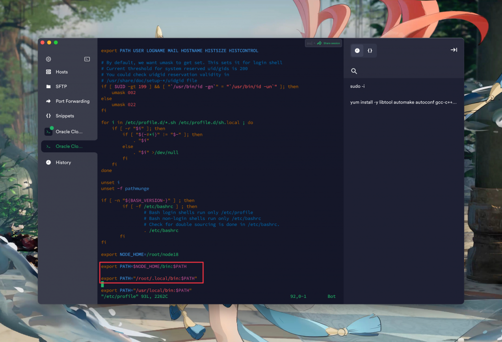
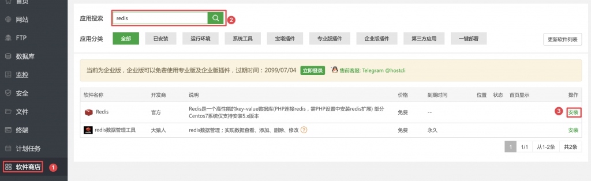
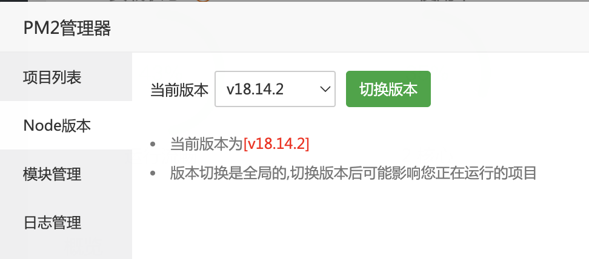
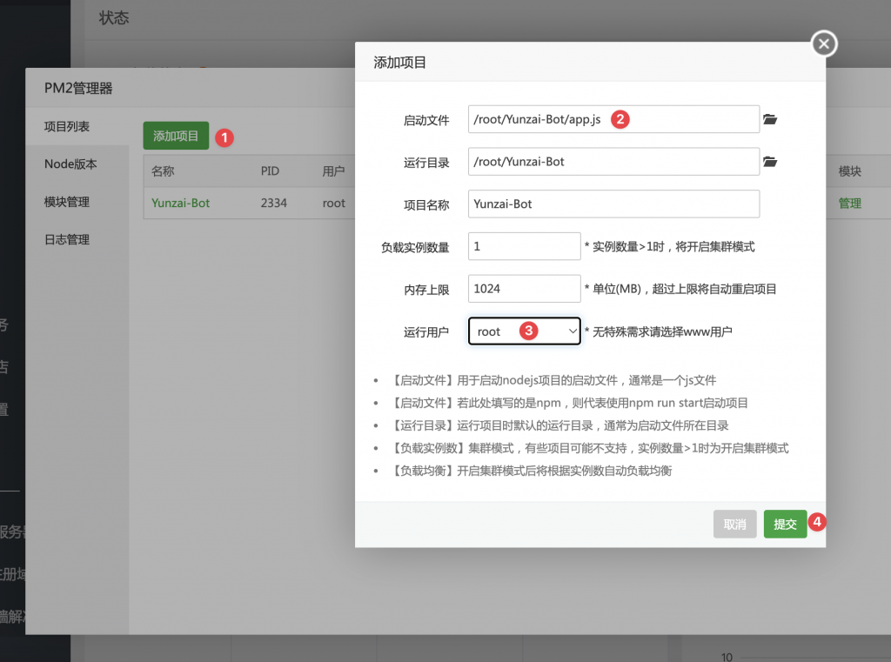

# 在Oracle Linux上部署Yunzai Bot v3保姆式教程

[在Oracle Linux上部署Yunzai Bot v3保姆式教程 – 肚 (iocky.com)](https://iocky.com/index.php/2023/02/28/在oracle-linux上部署yunzai-bot-v3保姆式教程/)

## 初始配置

直接注册最低配置的就ok了，这里不再赘述如何注册Oracle Cloud以及开设Compute Instance。

先点进目标实例，然后点进目标子网，再在安全列表内点进默认的那个安全列表，添加符合如下信息的入站规则：

```
源CIDR 0.0.0.0/0 – 所有协议
```

这样就直接开放了全部端口，也可以根据需要选择只开放使用的入站端口（TCP协议），再开放全部的ICMP协议，这里还是看个人需求取舍。直接用上面给出的规则是最暴力的解决办法。

现在可以使用创建实例时的SSH密钥连接VPS了。默认用户应该是**opc**。

先获得权限

```
sudo -i
```

接下来可以直接升级，也可以不升级：

```
dnf update -y
```

然后可以装一些别的东西：

```
dnf install curl gcc openssl-devel bzip2-devel libffi-devel zlib-devel wget make -y
```

参考[宝塔纯净版](https://www.hostcli.com/)的文档，安装纯净版宝塔：

```
yum install -y wget && wget -O install.sh http://v7.hostcli.com/install/install_6.0.sh && sh install.sh
```

安装完毕会提示以下内容：

```
==================================================================

外网面板地址: http://你的公网IP:8888/随机代码
内网面板地址: http://10.0.0.166:8888/随机代码
username: 你的用户名
password: 你的密码
If you cannot access the panel,
release the following panel port [8888] in the security group

若无法访问面板，请检查防火墙/安全组是否有放行面板[8888]端口

==================================================================
```

如果没看到上面的消息，也可以用下面的指令再次显示你的相关信息：

```
sudo /etc/init.d/bt default
```

进入宝塔后会提示你安装一些软件，根据需要安装即可，我是直接全部安装了，php选的7.2版本。

全部安装完成后，记得更改默认端口（宝塔、TCP、SSH、phpMyAdmin等的端口），如果在第一步没有开放全部的端口，记得增加新的端口入站规则。

## 安装Yunzai Bot v3

### 配置环境

然后参考[官方文档](https://gitee.com/yoimiya-kokomi/Yunzai-Bot)、[b站文档](https://www.bilibili.com/read/cv19255874)，如下步骤安装bot。

安装环境：

```
yum install -y libtool automake autoconf gcc-c++ openssl-devel
```

安装node18：

```
wget https://nodejs.org/dist/v18.14.2/node-v18.14.2-linux-x64.tar.xz
tar -xvf node-v18.14.2-linux-x64.tar.xz
mv node-v18.14.2-linux-x64 node18
chmod 777 node18
vim /etc/profile
```

在弹出的vim窗口按**i**进入编辑模式，在末尾加上如下内容，加完之后**Esc**推出编辑模式，然后**:wq**回车保存退出。

```
export NODE_HOME=/root/node18

export PATH=$NODE_HOME/bin:$PATH
```

如图，之后也类似。接下来重新索引环境变量：

```
source /etc/profile
```

可以通过 **node -v** 和 **npm -v** 判断是否成功安装。

然后安装pnpm和cnpm：

```
npm install -g pnpm
npm install -g cnpm
```

安装软件源与git：

```
yum install -y epel-release
yum install git
```

### 安装chromium：

解决方案来自[superuser](https://superuser.com/questions/691999/web-browsers-for-oracle-linux)，首先新建文件：

```
vim /etc/yum.repos.d/google-chrome.repo
```

在vim编辑器中新增如下内容：

```
[google-chrome]
name=google-chrome
baseurl=http://dl.google.com/linux/chrome/rpm/stable/x86_64
gpgkey=https://dl.google.com/linux/linux_signing_key.pub
gpgcheck=1
enabled=1
```

依旧是编辑完成后**:wq**保存退出，然后执行以下指令就可以成功安装chromium了：

```
sudo yum install google-chrome
```

安装字体（可选）：

```
yum groupinstall fonts -y
```

然后进入宝塔，安装redis和PM2，如图：



通过宝塔安装的redis安装完毕后会自动运行，我们只要确认PM2里的node版本是刚刚我们安装的18.14.2就好，如图：



### 正式安装

先返回root根目录

```
cd
```

克隆仓库：

```
git clone --depth 1 -b main https://gitee.com/Le-niao/Yunzai-Bot.git
```

如果失败，请尝试：

```
git clone --depth 1 -b main http://gitee.com/Le-niao/Yunzai-Bot.git
```

克隆完成后打开目标文件夹并且安装依赖：

```
cd /root/Yunzai-Bot/
pnpm install -P
```

之后就可以运行了：

```
node app
```

可以在命令行下通过**Ctrl+C**停止运行。后续我们也可以用PM2管理项目运行，如图添加：



这样一来我们就成功安装上了。

接下来是运行**node app**后常见的问题解法，实际上大部分官方文档里都有，我就遇到了一个问题：

### 登陆QQ失败解决方案

解决方法如下，来自[这个文档](https://gitee.com/bling_yshs/Yunzai-v3-Installation-Steps)：

1. 在自己的常用电脑上下载这个文件：[QQ验证v1.0.4.zip](https://puguying-my.sharepoint.com/:u:/g/personal/fa2nica_wr_puguying_cn/Ebuu3PPnhuRHjT5-fbNcpsgB_2gS7fgY1LKNHy6wwb2W9g?e=aw0zTM)
2. 解压，运行 `**密码登录.exe**`
3. 根据程序提示，输入自己小号的账号和密码
4. 如果遇到验证码，请选择扫码验证(要用手机登录小号的 QQ 扫码哦)(放大后如果二维码消失的话，可以在目录里找到 `qrcode.png` 打开来扫)
5. 检查目录，会发现会多出一个QQ`号文件夹`
6. 把整个文件夹复制到 `Yunzai-bot/data` 里，替换掉原来的文件夹就行(这个操作可以通过宝塔完成，很方便)

登陆过程中可能还需要安装一个滑动验证码app.apk，链接在命令行里就有，如果挂了，可以从[这里](https://puguying-my.sharepoint.com/:u:/g/personal/fa2nica_wr_puguying_cn/EUIYlB8RAkdKvNDwHDUl77QBaBZB0pZanp0mS16zXzJpiw?e=StzIUt)下载，使用很明了。

然后就可以愉快的使用啦！接下来是一些插件的安装方法。

## 安装插件

[插件索引点我](https://github.com/yhArcadia/Yunzai-Bot-plugins-index)

### 安装[喵喵插件](https://gitee.com/yoimiya-kokomi/miao-plugin)、[锅巴插件](https://gitee.com/guoba-yunzai/guoba-plugin)与[图鉴插件](https://gitee.com/Ctrlcvs/xiaoyao-cvs-plugin)：

```
git clone --depth 1 -b master https://gitee.com/yoimiya-kokomi/miao-plugin.git ./plugins/miao-plugin/

pnpm add image-size -w


git clone --depth=1 https://gitee.com/guoba-yunzai/guoba-plugin.git ./plugins/Guoba-Plugin/

pnpm install --no-lockfile --filter=guoba-plugin -w


git clone --depth=1 https://gitee.com/Ctrlcvs/xiaoyao-cvs-plugin.git ./plugins/xiaoyao-cvs-plugin/

pnpm add promise-retry -w` 再 `pnpm add superagent -w
```

锅巴插件的默认端口是50831，记得去宝塔里放行这个端口（安全里面），如果先前不是放开全部规则的，也记得在Oracle Cloud里放行这个端口。不同插件使用详细请见他们各自的仓库～

### 安装[TRSS 插件 (TRSS-Plugin)](https://yunzai.trss.me/):

由于TRSS插件需要python3.10，我们这边先安装python3.10，安装步骤如下，来自[How to Install Python 3.10 on Oracle Linux 8 | Atlantic.Net](https://www.atlantic.net/dedicated-server-hosting/how-to-install-python-3-10-on-oracle-linux-8/)：

#### 在Oracle Linux8上安装python3.10

切换回根目录

```
cd
```

访问 Python官方下载页面并使用以下命令下载最新版本的3.10.9的Python：

```
wget https://www.python.org/ftp/python/3.10.9/Python-3.10.9.tgz 
```

下载完成后解压缩包：

```
tar -xf Python-3.10.9.tgz 
```

切换到解压后的目录

```
cd Python-3.10.9
```

配置python

```
./configure --enable-optimizations
```

启动build进程：

```
make -j 2
nproc
```

安装Python

```
make altinstall
```

成功安装后可以使用以下命令验证安装是否成功：

```
python3.10 --version
```

如果不成功，记得在/etc/profile添加环境变量，这里不再赘述前面讲过如何添加，只提供需要添加到最后的内容，记得在保存退出后重新索引：

```
export PATH="/usr/local/bin:$PATH"
```

接下来是扩展内容，不需要操作，就不翻译了。

Python provides a venv module that helps developers to create a virtual environment and deploy applications easily in an isolated environment.

To create a virtual environment named python-env, run the following command:

```
python3.10 -m venv python-env
```

Next, activate the virtual environment using the following command:

```
source python-env/bin/activate
```

You will get the following shell:

```
(python-env) [root@oraclelinux8 ~]#
```

Now, you can use the PIP package manager to install any package and dependencies inside your virtual environment.

For example, run the following command to install apache-airflow:

```
pip3.10 install apache-airflow
```

If you want to remove this package, run the command below:

```
pip3.10 uninstall apache-airflow
```

To exit from the Python virtual environment, run the following command:

```
deactivate
```

#### 安装其他环境与插件

安装poetry，官方提供的指令是：

```
curl -sSL https://install.python-poetry.org | python3 -
```

如果不成功，可以尝试：

```
curl -sSL https://install.python-poetry.org | python3.10 -
```

成功后切换回Yunzai Bot的目录：

```
cd /root/Yunzai-Bot
```

克隆与安装

```
git clone --depth 1 https://Yunzai.TRSS.me plugins/TRSS-Plugin

pnpm i
```

接下来是可选项，如果想要使用这个插件的 `图片修复` | `图片背景去除` | `语音合成` 功能。

```
poetry install
```

直接安装，然后会发现卡在安装torch了，于是尝试使用pip安装，结果依然卡在最后，后来去[查了一下](https://stackoverflow.com/questions/62301268/whenever-i-try-to-install-torch-it-displays-killed)，原来是RAM不够，于是可以这样安装。

```
pip3.10 install torch --no-cache-dir
```

既然装好了torch，那我们继续使用poetry安装..

```
poetry install
```

还是报错，这回是Timeout了，先搁置吧..

### 安装[光遇插件 (Tlon-Sky)](https://gitee.com/Tloml-Starry/Tlon-Sky)，[清凉图插件 (yunzai-c-v-plugin)](https://gitee.com/xwy231321/yunzai-c-v-plugin)与[ChatGPT问答插件（chatgpt-plugin）](https://github.com/ikechan8370/chatgpt-plugin)

```
cd /root/Yunzai-Bot


git clone --depth=1 https://gitee.com/Tloml-Starry/Tlon-Sky.git ./plugins/Tlon-Sky/


git clone --depth=1 https://gitee.com/xwy231321/yunzai-c-v-plugin.git ./plugins/yunzai-c-v-plugin/


git clone --depth=1 https://github.com/ikechan8370/chatgpt-plugin.git ./plugins/chatgpt-plugin/

cd plugins/chatgpt-plugin

pnpm i
```

修改ChatGPT插件配置：复制plugins/chatgpt-plugin/config/config.example.js并将其改名为config.js 编辑plugins/chatgpt-plugin/config/config.js文件，根据其中的注释修改必要配置项。

最后重启Yunzai Bot，大功告成。